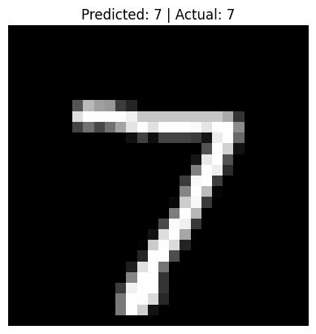
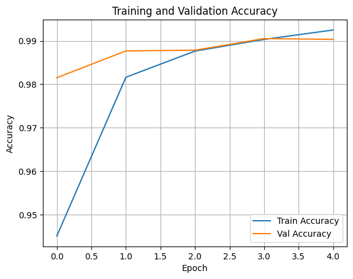
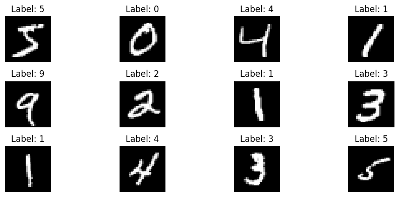

# ✍️ Handwritten Digit Classifier using CNN | MNIST Dataset

A powerful deep learning model that classifies handwritten digits from 0 to 9 using a **Convolutional Neural Network (CNN)** architecture. 
This project leverages the MNIST dataset to showcase the power of image recognition through neural networks, which form the core of various AI applications today.

---

## 📘 Extended Project Description

Recognizing handwritten digits is one of the most classic and fundamental tasks in computer vision. 
Though seemingly simple, it opens the doors to understanding how machines interpret visual data — whether it's recognizing a number on a cheque, processing addresses on envelopes, 
or enabling OCR (Optical Character Recognition) systems.

This project utilizes the MNIST dataset and builds a CNN that mimics the human ability to distinguish digits by learning patterns, curves, edges, and intensity. 
With just a few convolutional layers, the model achieves remarkable accuracy (~98%), demonstrating the strength of deep learning for supervised image classification.

The core idea is to go beyond traditional pixel-based models and allow the CNN to learn **features** hierarchically — from lines and edges in early layers to complex shapes and digit outlines in deeper ones.

---

## 🔬 Real-World Relevance

### 💼 Industry Applications:
- Bank check digit recognition
- Postal code automation
- License plate recognition
- Automated digit entry systems
- Captcha solvers

### 🧠 Academic Relevance:
- Serves as a starter project for CNNs
- Basis for extending into deeper networks like ResNet, LeNet
- Offers insights into data preprocessing, one-hot encoding, and architecture tuning

---

## 📌 Project Highlights

- Dataset: **MNIST** (built into Keras/TensorFlow)
- Model: **CNN** with 2 Conv layers, 2 MaxPooling layers, and Dense layers
- Output: Classification of digits (0-9)
- Evaluation: Accuracy, loss curves, sample predictions
- Frameworks: `TensorFlow`, `Keras`, `NumPy`, `Matplotlib`

---

## 📊 Sample Visual Output

### 🖼️ Digit Prediction Examples
<p align="center">
  
</p>

### 📈 Training vs Prediction
<p align="center">
  
</p>

### 📈 Generations
<p align="center">
  
</p>
---

## 🧠 CNN Architecture Overview

```text
Input: 28x28 grayscale image
↓
Conv2D: 32 filters, 3x3 kernel, ReLU
↓
MaxPooling2D: 2x2
↓
Conv2D: 64 filters, 3x3 kernel, ReLU
↓
MaxPooling2D: 2x2
↓
Flatten
↓
Dense: 64 units, ReLU
↓
Output Layer: 10 units, Softmax (digit classes)
